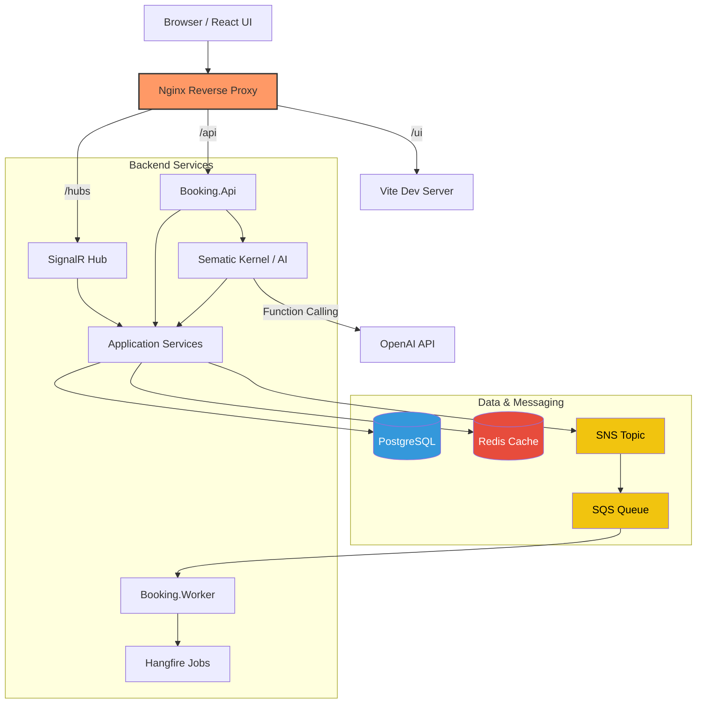
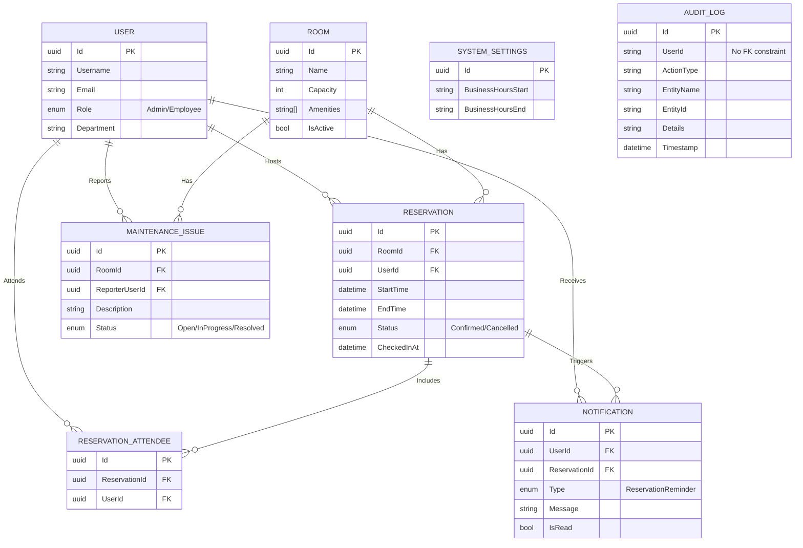

# Booking System - High Level Design (HLD)

## 1. System Overview

The Booking System is a real-time room and facility reservation platform. It allows users to browse available rooms, book time slots, and receive live availability updates. The system is built using a modern, event-driven microservices architecture to ensure high availability, scalability, and maintainability.

---

## 2. Architecture Diagram (Logical View)

---

## 3. Database Entity-Relationship Diagram (ERD)

---

## 4. Core Components

### 4.1. Frontend Gateway & UI

- **Nginx Gateway (`:5173`)**: Acts as the single entry point. Eliminates CORS issues by routing `/` to the React frontend, `/api` to the backend REST endpoints, and `/hubs` to the SignalR WebSocket server.
- **React Frontend**: A Vite-powered Single Page Application (SPA) providing calendar views, room management boards, and an AI chat interface.

### 4.2. Backend APIs (`Booking.Api`)

- **ASP.NET Core Web API**: Exposes RESTful endpoints via standard Controllers (`ReservationsController`, `RoomsController`, etc.).
- **Application Service Layer (N-Tier)**: Encapsulates all business logic using domain services (e.g., `IReservationService`, `IRoomService`). These services orchestrate validation, talk to EF Core repositories, and publish messaging events.
- **MediatR (Pipeline & Cache)**: While the primary architecture is Service-based, MediatR is selectively used for specific internal features and cross-cutting concerns (like injecting caching pipeline behaviors).
- **Semantic Kernel**: Orchestrates conversational AI. Parses natural language, invokes native C# plugins (e.g., `RoomPlugin`), and returns structured JSON to hydrate UI Booking Cards.

### 4.3. Asynchronous Worker (`Booking.Worker`)

- **SQS Consumer**: Long-polls AWS SQS (emulated locally via Moto) to process asynchronous domain events (e.g., sending booking confirmation emails, syncing external calendars) without blocking the HTTP request thread.
- **Hangfire**: Manages scheduled and recurring jobs (e.g., releasing abandoned bookings, daily maintenance tasks) backed by Postgres.

### 4.4. Data Storage & Caching

- **PostgreSQL (`Booking.Infrastructure`)**: The primary relational datastore. Stores Users, Rooms, Reservations, and Audit Logs. Managed via Entity Framework Core Migrations.
- **Redis**: Used for distributed caching of frequently accessed read-heavy data (like room lists) and backplane scaling for SignalR hubs.

---

## 5. Integration & Observability

- **Messaging (AWS SNS/SQS)**: Event-driven pub/sub model. When a booking is created, the API publishes to an SNS topic. SQS queues subscribe to this topic, decoupling the web API from slow downstream processes.
- **Observability (M.E.L.T)**:
    - **New Relic**: Injected via .NET CLR Profiler for APM (Application Performance Monitoring), tracking method execution times and distributed tracing.
    - **Splunk / Fluent-Bit**: A Fluent-Bit sidecar container forwards structured JSON application logs and Nginx access logs to a centralized Splunk Enterprise dashboard.

---

## 6. Quality Assurance Suite

- **Integration Testing**: Uses `WebApplicationFactory` to spin up the API in-memory. Business logic (like `IBookingRuleEngine`) and External dependencies (like `IEventPublisher`) are mocked via `Moq` to ensure deterministic execution.
- **End-to-End Testing (Playwright)**: Automates Chromium browsers to validate complete user journeys (login, booking, UI state changes).
- **Load Testing (Grafana K6)**: Simulates concurrent Virtual Users (VUs) to benchmark API throughput and guarantee sub-500ms response times under stress.
