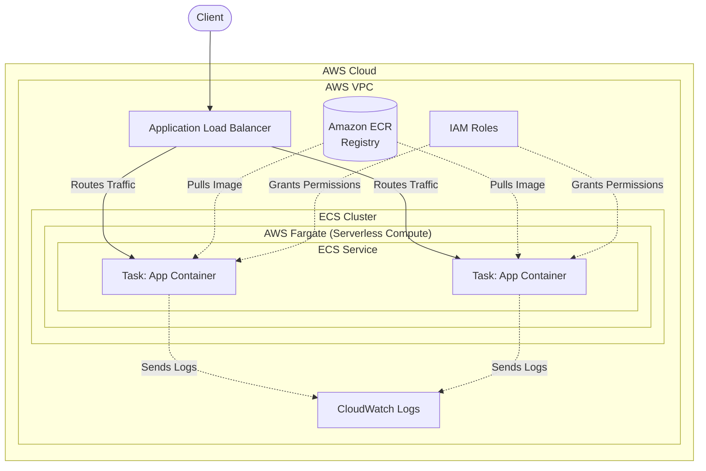

# AWS ECS

**Status:** Research only (not yet built)
**OJT tracker category:** DevOps

## Summary

Amazon Elastic Container Service (ECS) is a fully managed container orchestration service provided by AWS. It allows for running, scaling, and securing Docker containers efficiently across a cluster.

## Key Concepts

- **Task Definition:** The blueprint for the application (similar to `docker-compose.yml`), defining container images, CPU/memory limits, environment variables, and ports.
- **Task:** A running instance of a Task Definition.
- **Service:** Ensures a specified number of Tasks are running and handles restarting failed tasks. Integrates natively with Elastic Load Balancer (ELB).
- **Cluster:** A logical grouping of tasks or services.
- **Fargate:** Serverless compute for containers. Removes the need to provision or manage underlying EC2 servers.
- **EC2:** Traditional compute where you manage a cluster of EC2 instances and ECS places containers on them.
- **ECR (Elastic Container Registry):** AWS's managed Docker registry. ECS pulls container images from ECR to run them in Tasks.

### Architecture Overview



## Reference / Cheatsheet

### Container Orchestrators Comparison

| Feature | AWS ECS | AWS EKS (Kubernetes) | Kubernetes (Self-hosted/GKE/AKS) | Docker Swarm |
| :--- | :--- | :--- | :--- | :--- |
| **Ecosystem** | AWS Native | Open Source (CNCF) | Open Source (CNCF) | Docker Native |
| **Complexity to Learn** | Low to Medium | High | Very High | Low |
| **Management Overhead** | Very Low (with Fargate) | Medium (AWS manages control plane) | High (You manage everything) | Low |
| **Portability** | Low (Tied to AWS) | High (Standard K8s APIs) | Very High (Runs anywhere) | Medium |
| **Best Use Case** | Teams already in AWS who want a simple, robust way to run containers. | Large microservices, multi-cloud portability, vast ecosystem. | Multi-cloud or on-premise with dedicated DevOps. | Small teams needing a simple orchestrator. |

### Terraform ECS Fargate Example

```hcl
# 1. Define the ECS Cluster
resource "aws_ecs_cluster" "my_cluster" {
  name = "example-ecs-cluster"
}

# 2. Define an IAM Role for the Task Execution
resource "aws_iam_role" "ecs_execution_role" {
  name = "ecs_execution_role"
  assume_role_policy = jsonencode({
    Version = "2012-10-17"
    Statement = [{ Action = "sts:AssumeRole", Effect = "Allow", Principal = { Service = "ecs-tasks.amazonaws.com" } }]
  })
}

resource "aws_iam_role_policy_attachment" "ecs_execution_role_policy" {
  role       = aws_iam_role.ecs_execution_role.name
  policy_arn = "arn:aws:iam::aws:policy/service-role/AmazonECSTaskExecutionRolePolicy"
}

# 3. Define the Task Definition
resource "aws_ecs_task_definition" "nginx_task" {
  family                   = "nginx-task"
  network_mode             = "awsvpc"
  requires_compatibilities = ["FARGATE"]
  cpu                      = "256"
  memory                   = "512"
  execution_role_arn       = aws_iam_role.ecs_execution_role.arn

  container_definitions = jsonencode([{
    name      = "nginx"
    image     = "nginx:latest"
    essential = true
    portMappings = [{ containerPort = 80, hostPort = 80 }]
  }])
}

# 4. Define the ECS Service
resource "aws_ecs_service" "nginx_service" {
  name            = "nginx-service"
  cluster         = aws_ecs_cluster.my_cluster.id
  task_definition = aws_ecs_task_definition.nginx_task.arn
  launch_type     = "FARGATE"
  desired_count   = 1

  network_configuration {
    subnets          = ["subnet-xxxxxxxxxxxxxxxxx", "subnet-yyyyyyyyyyyyyyyyy"]
    security_groups  = ["sg-zzzzzzzzzzzzzzzzz"]
    assign_public_ip = true
  }
}
```

## Applied In This Project

Research only (not yet built) — no build dependency in this project currently.

## Related Notes

- [[aws-ec2]] — ECS can use EC2 instances as the compute backend instead of Fargate.
- [[aws-vpc]] — ECS tasks in `awsvpc` network mode require VPC subnets and security groups to function properly.
