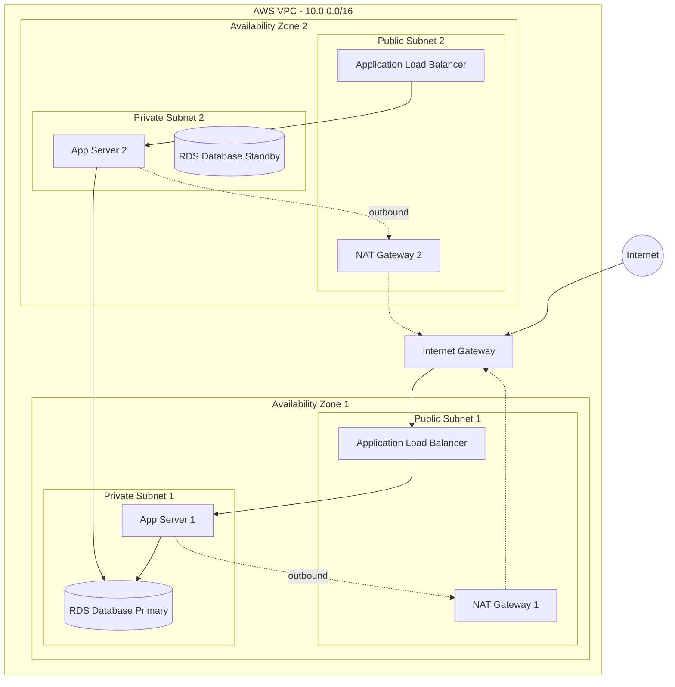

# AWS VPC (Virtual Private Cloud)

**Status:** Research only (not yet built)
**OJT tracker category:** DevOps / Architecture

## Summary

AWS VPC (Virtual Private Cloud) allows you to launch AWS resources into a logically isolated virtual network that you define. It is the foundational networking layer for securely hosting applications, databases, and services on AWS.

## Key Concepts

- **VPC & CIDR Blocks:** A VPC is defined by a range of IP addresses (CIDR block) determining what IPs can be assigned to resources inside it.
- **Subnets:** Smaller chunks of the VPC's IP range tied to specific Availability Zones (AZs).
  - **Public Subnet:** Has a route to the internet via an Internet Gateway.
  - **Private Subnet:** No direct internet route; used for secure backend/database hosting.
- **Internet Gateway (IGW):** Allows communication between instances in your VPC (public subnets) and the internet.
- **NAT Gateway:** Placed in a public subnet to allow private subnet resources to fetch outbound internet data (e.g., updates) without allowing inbound connections.
- **Security Groups (SGs):** Instance-level, stateful virtual firewalls controlling inbound and outbound traffic.
- **Network Access Control Lists (NACLs):** Subnet-level, stateless firewalls acting as a secondary defense layer.

## Reference / Cheatsheet

### Standard 2-Tier Architecture Setup
- **Public Subnets (2 AZs):** Contains the Application Load Balancer (ALB) and NAT Gateway.
- **Private Subnets (2 AZs):** Contains App Servers (EC2/ECS) and Databases (RDS).
- **Traffic Flow:**
  - Internet -> ALB (Public Subnet) -> App Server (Private Subnet) -> Database (Private Subnet).
- **Security Group Chaining:**
  - ALB SG: Allow inbound HTTP/HTTPS from `0.0.0.0/0`.
  - App Server SG: Allow inbound from ALB SG *only*.
  - DB SG: Allow inbound from App Server SG *only*.

### Architecture Diagram

## Applied In This Project

- Research-only — no build dependency yet, but serves as architectural reference for future cloud deployment of the Booking System.

## Related Notes

- [[docker]] — Containerized applications would be deployed within the VPC (e.g., via ECS/Fargate).
- [[postgresql_fundamentals]] — The RDS instance would reside in a private subnet.

## Open Questions / Next Steps

- Determine if the project will use Infrastructure as Code (e.g., AWS CDK, Terraform) to provision the VPC.
