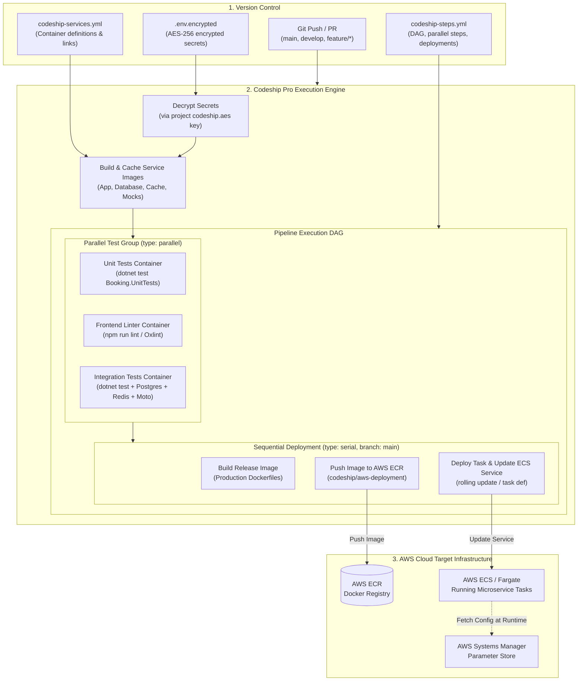
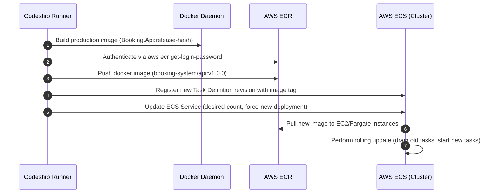

# Codeship CI/CD

**Status:** Research only (not yet built)
**OJT tracker category:** DevOps / CI/CD

## Summary

Codeship (acquired by CloudBees in 2018 and officially sunset / reached **End of Life in January 2026**) is a hosted Continuous Integration and Continuous Delivery (CI/CD) platform designed to automate application testing, container building, and cloud deployments. Codeship offered two distinct architectural tiers: **Codeship Basic** (a turnkey, pre-configured VM environment suited for standard web stacks) and **Codeship Pro** (a paid, Docker-native, configuration-as-code CI/CD engine driven by `codeship-services.yml` and `codeship-steps.yml`). Within cloud-native DevOps and AWS ecosystems, Codeship Pro became widely adopted for microservice architectures due to its first-class multi-container workflow, local pipeline reproducibility via the **Jet CLI**, and automated deployment integrations with AWS Elastic Container Registry (ECR) and AWS Elastic Container Service (ECS).

---

## Key Concepts

### Codeship Basic vs. Codeship Pro

Codeship provides two fundamentally different execution models depending on repository requirements:

| Dimension | Codeship Basic | Codeship Pro |
| :--- | :--- | :--- |
| **Target Workloads** | Classic monoliths, single-stack web apps (Rails, Node, Python, Java, PHP) | Microservices, polyglot applications, containerized architectures |
| **Pipeline Definition** | Web UI dashboard or single declarative script setup | Configuration as Code: `codeship-services.yml` and `codeship-steps.yml` |
| **Runtime Environment** | Pre-installed language runtimes on shared VMs | Dedicated Docker containers built dynamically per step or service |
| **Local Pipeline Execution** | Not supported (cloud-only runs) | Fully reproducible locally via the **Jet CLI** (`jet steps`) |
| **Parallel Execution** | Limited to parallel test pipelines configured in UI | Declarative DAG with parallel step groups (`type: parallel`) |
| **Secret Management** | UI-configured environment variables | AES-256 encrypted environment files (`.env.encrypted`) committed to Git |
| **Docker Support** | Docker commands available, but VM-centric | Native Docker daemon, multi-container orchestration, image caching |

---

### Codeship Pro Architecture & Pipeline Flow

In Codeship Pro, every build, test, and deployment step executes inside an ephemeral Docker container defined by the project.



1. **Trigger & Decryption**: On code push, the runner pulls the repository, retrieves the project's secret AES key (`codeship.aes`), and decrypts `.env.encrypted` in memory.
2. **Service Assembly (`codeship-services.yml`)**: Builds or pulls container images for application code and dependencies (e.g. PostgreSQL, Redis, AWS Moto mock).
3. **Step Execution (`codeship-steps.yml`)**: Runs independent steps either sequentially (`type: serial`) or concurrently (`type: parallel`). Each step runs in an isolated container.
4. **Artifact & Image Delivery**: If tests succeed and the branch matches deployment criteria, specialized deployment containers (e.g. `codeship/aws-deployment`) push images to AWS ECR and trigger AWS ECS updates.

---

### Dual-File Configuration Model

Codeship Pro separates **what runs** from **how it runs**:

1. **`codeship-services.yml` (Services & Infrastructure)**:
   - Heavily inspired by Docker Compose syntax (`version: '2'` semantics).
   - Specifies container build contexts, base images, bound volumes, exposed ports, linked dependent services, and encrypted environment files.
   - Supports Docker layer caching (`cached: true`) to accelerate rebuilds.

2. **`codeship-steps.yml` (Workflow & Lifecycle)**:
   - Defines the sequence, concurrency, and conditions of tasks.
   - Specifies which container runs which command (`service: <name>`, `command: <shell command>`).
   - Grouping:
     - `type: serial`: Steps execute one after another; any failure halts the pipeline immediately.
     - `type: parallel`: Steps run simultaneously across available worker threads.
   - Branch Filtering: Steps can be scoped to specific branches or tags (e.g. `tag: "^v[0-9]+"` or `exclude: "^dependabot/"`).

---

### Local Reproducibility with Jet CLI (`jet`)

A primary differentiator of Codeship Pro is **Jet**, an open-source local CLI utility that parses the exact same YAML configuration used by cloud workers:

```bash
# Validate configuration syntax
jet validate

# Execute the entire CI pipeline locally using local Docker daemon
jet steps

# Run a specific ad-hoc service container
jet run app dotnet test

# Encrypt sensitive environment variables using project AES key
jet encrypt .env.raw .env.encrypted
```

- **Zero Feedback Latency**: Developers can run `jet steps` on their workstation to catch broken builds, failed linting, or failing container integration tests before opening a pull request.
- **Identical Environments**: Because Jet uses the local Docker daemon to orchestrate the exact same images defined in `codeship-services.yml`, it avoids "it works on my machine but breaks in CI" disparities.

---

### Secret Management (`codeship.aes`)

Codeship Pro eliminates uncommitted or plaintext secrets via client-side AES-256 encryption:

1. **Project Key (`codeship.aes`)**: A 256-bit encryption key downloaded from the project settings dashboard and added to `.gitignore`.
2. **Encryption Workflow**:
   ```bash
   jet encrypt .env.production .env.production.encrypted
   ```
3. **Version Control**: The encrypted file (`.env.production.encrypted`) is safe to commit into Git.
4. **Decryption**: In the cloud, Codeship holds the AES key and decrypts the file directly into container memory during step execution.

---

### AWS Deployment Pipeline (ECR & ECS)

Codeship Pro includes official pre-built deployment containers (`codeship/aws-deployment` and `codeship/aws-ecs`) tailored for AWS infrastructure:



- **Authentication**: Uses AWS Access Key / Secret Key pairs (encrypted in `.env.encrypted`) or AWS IAM Role delegation.
- **Image Push**: Logs into ECR via the AWS CLI and tags/pushes production images.
- **Task Definition & Rolling Updates**: Updates the ECS task definition revision and triggers `aws ecs update-service --force-new-deployment`.

---

### Codeship Pro vs. GitHub Actions

Both platforms serve modern CI/CD needs, but approach configuration and execution with distinct philosophies:

| Feature | Codeship Pro | GitHub Actions (Current Project) |
| :--- | :--- | :--- |
| **Pipeline Definition** | Two files: `codeship-services.yml` + `codeship-steps.yml` | Unified YAML in `.github/workflows/*.yml` |
| **Execution Primitives** | Container-only (every step runs inside a Docker container) | Virtual machine (VM) runners (`ubuntu-latest`) with optional container actions |
| **Local Pipeline Execution** | Native first-class CLI (`jet steps`, `jet run`) | Requires third-party tools like `act` (Docker-dependent emulation) |
| **Integration Test Infra** | Multi-container composition defined in `codeship-services.yml` | Docker Compose invoked via CLI (`docker compose up -d`) on host VM |
| **Ecosystem & Marketplace** | Official Docker utility images (`codeship/aws-deployment`) | Expansive GitHub Actions Marketplace (`actions/*`, community actions) |
| **Secrets & Encryption** | Client-side encrypted files committed to Git (`codeship.aes`) | Repository / Environment Secrets stored securely in GitHub platform |
| **Pricing & Availability** | Paid-only for private repos (historically starting at ~$75/mo); **Discontinued / End of Life (Jan 2026)** | Free tier (2,000 min/mo private repos, unlimited public); actively maintained |
| **Current Industry Adoption** | Sunset in January 2026 by CloudBees; migrations directed to GitHub Actions / GitLab CI | Dominant industry standard for GitHub-hosted repositories |

---

## Reference / Cheatsheet

### `codeship-services.yml` Example

```yaml
# codeship-services.yml
version: '2'
services:
  # .NET 10 API build & test runner
  api-builder:
    build:
      image: booking-api-test
      dockerfile_path: src/Booking.Api/Dockerfile
    cached: true
    encrypted_env_file: .env.codeship.encrypted
    links:
      - postgres
      - redis
      - moto

  # PostgreSQL database dependency
  postgres:
    image: postgres:17-alpine
    environment:
      POSTGRES_DB: booking_test
      POSTGRES_USER: booking
      POSTGRES_PASSWORD: testpassword

  # Redis cache dependency
  redis:
    image: redis:7-alpine

  # Moto AWS SNS/SQS mock dependency
  moto:
    image: motoserver/moto:latest
    environment:
      MOTO_PORT: 5000

  # AWS Deployment utility container
  aws-deployment:
    image: codeship/aws-deployment
    encrypted_env_file: .env.aws.encrypted
```

### `codeship-steps.yml` Example

```yaml
# codeship-steps.yml
- type: parallel
  name: "Parallel Quality & Test Verification"
  steps:
    # Step 1: Execute .NET Unit Tests
    - name: "Run .NET Unit Tests"
      service: api-builder
      command: dotnet test test/Booking.UnitTests --configuration Release

    # Step 2: Execute Containerized Integration Tests
    - name: "Run Integration Tests against Backing Services"
      service: api-builder
      command: dotnet test test/Booking.IntegrationTests --configuration Release

- type: serial
  name: "AWS Production Deployment Pipeline"
  tag: "^v[0-9]+\\.[0-9]+\\.[0-9]+"
  steps:
    # Authenticate and push image to AWS ECR
    - name: "Push to AWS ECR"
      service: aws-deployment
      command: >
        bash -c "
        aws ecr get-login-password --region us-east-1 | docker login --username AWS --password-stdin 123456789012.dkr.ecr.us-east-1.amazonaws.com &&
        docker tag booking-api-test:latest 123456789012.dkr.ecr.us-east-1.amazonaws.com/booking-api:$CI_COMMIT_ID &&
        docker push 123456789012.dkr.ecr.us-east-1.amazonaws.com/booking-api:$CI_COMMIT_ID
        "

    # Trigger ECS Service Deployment
    - name: "Deploy to AWS ECS"
      service: aws-deployment
      command: >
        aws ecs update-service
        --cluster booking-cluster
        --service booking-api-service
        --force-new-deployment
        --region us-east-1
```

### Jet CLI Commands

```bash
# Syntax and schema verification
jet validate

# Run entire pipeline locally using local Docker
jet steps

# Run specific service step interactively
jet run api-builder /bin/bash

# Encrypt sensitive environment variables
jet encrypt .env.production .env.production.encrypted

# Clean up ephemeral containers created by Jet runs
jet clean
```

---

## Applied In This Project

Research-only per OJT Sprint 3 (Part A: AWS Infrastructure Reading) — no direct build dependency.

BookingSystem utilizes **GitHub Actions** (`.github/workflows/ci.yml`) as its primary CI/CD engine. However, the architectural concepts embodied by Codeship Pro directly correspond to this repository's structure:

- **Multi-Container Services (`codeship-services.yml` ↔ `src/docker-compose.yml`)**:
  - In Codeship Pro, test dependencies (`postgres`, `redis`, `moto`) are defined as linked services in `codeship-services.yml`.
  - In our GitHub Actions CI workflow, these exact same services are spun up on the `ubuntu-latest` runner via `docker compose -f src/docker-compose.yml up -d postgres redis moto moto-init`.
- **Parallel Quality Gates (`codeship-steps.yml` ↔ `.github/workflows/ci.yml`)**:
  - Codeship Pro uses `type: parallel` to run unit tests and frontend validation concurrently.
  - BookingSystem mirrors this via separate concurrent GitHub Actions jobs: `backend` (.NET 10 SDK) and `frontend` (Node 22, Oxlint, Vite build).
- **Target AWS Deployment Pipeline**:
  - The deployment steps defined in Codeship (`codeship/aws-deployment` pushing to ECR and calling `aws ecs update-service`) model the planned production path for `Booking.Api` and `Booking.Worker` Docker images within the AWS cloud footprint.

---

## Related Notes

- [[github-actions]] — The project's active CI/CD platform executing automated build, test, and containerized integration workflows.
- [[docker]] — Containerization fundamentals, Dockerfiles, and compose configurations underpinning Codeship Pro's container-per-step engine.
- [[git-flow]] — Branching lifecycle (`main`, `develop`, feature branches) governing automated test and deployment triggers.
- [[moto]] — Mocked AWS SNS/SQS service container orchestrated alongside integration test runs.
- [[xunit-service-testing-notes]] — Unit and integration test suites executed within CI test steps.

---

## Open Questions / Next Steps

- **ECR/ECS CD Pipeline Migration**: Design a production continuous deployment workflow in GitHub Actions (or Codeship) using OpenID Connect (OIDC) authentication (`aws-actions/configure-aws-credentials`) rather than static long-lived IAM access keys.
- **AWS Parameter Store Integration**: Investigate runtime parameter injection in ECS task definitions referencing AWS SSM Parameter Store (`/booking/prod/*`) instead of baking secrets into container images or build-time environment files.
- **Local Pipeline Debugging**: Evaluate tooling such as `nektos/act` for local GitHub Actions simulation to match the developer ergonomics provided by Codeship's `jet` CLI.
