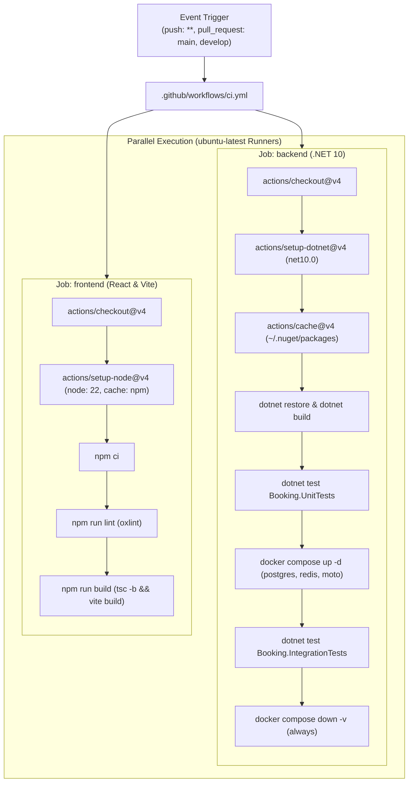

# GitHub Actions CI/CD

**Status:** Applied in project
**OJT tracker category:** DevOps / CI/CD

## Summary

GitHub Actions is GitHub's native continuous integration, continuous delivery (CI/CD), and workflow automation platform. It allows developers to define declarative YAML pipelines triggered by repository events (such as branch pushes, pull requests, or release milestones) that execute inside managed virtual environments. In this project, GitHub Actions runs automated CI pipelines on every push and pull request, executing parallel backend (.NET 10) and frontend (React/Vite) verification jobs, spinning up containerized integration test dependencies (PostgreSQL, Redis, Moto), and managing dependency caching for rapid feedback.

## Key Concepts



- **Declarative Workflows (`.github/workflows/*.yml`)**:
  - Workflows are defined as YAML files stored in `.github/workflows/`.
  - A single repository can host multiple independent workflows targeting distinct lifecycle concerns (e.g. CI testing, automated releases, scheduled security analysis, dependency vulnerability triage).
- **Event Triggers & Path Filtering (`on:`)**:
  - Workflows execute in response to Git events (`push`, `pull_request`, `release`, `schedule`, or manual `workflow_dispatch`).
  - Triggers can be scoped by branch patterns (e.g. `branches: [main, develop]` or wildcards `branches: ["**"]`) and file paths (e.g. `paths: ["src/**"]`).
- **Jobs & Parallelism (`jobs:`)**:
  - A workflow consists of one or more jobs. By default, jobs run **concurrently** on separate virtual runners.
  - Job dependencies can be enforced using `needs:` (e.g. `needs: [backend, frontend]` before running a deployment job).
  - Each job executes in an isolated environment with its own clean workspace.
- **Runners (`runs-on:`)**:
  - **GitHub-Hosted Runners**: Fully managed, ephemeral virtual machines (`ubuntu-latest`, `windows-latest`, `macos-latest`). Ubuntu runners come pre-configured with developer runtimes, the Docker engine, Docker Compose, and common CLIs.
  - **Self-Hosted Runners**: Privately managed compute instances capable of accessing internal VPC resources, custom accelerators, or specialized build hardware.
- **Steps & Composite Actions (`steps:`)**:
  - Steps are executed sequentially within the same runner and share the local file system.
  - Steps invoke shell scripts (`run:`) or reusable marketplace actions (`uses: <owner>/<repo>@<ref>`).
- **Dependency Caching (`actions/cache@v4`)**:
  - Re-downloading dependencies on every run incurs unnecessary network bandwidth and slows CI feedback.
  - Caching packages (`~/.nuget/packages` for .NET, `~/.npm` for Node.js) keyed by dependency hash fingerprints (`hashFiles('**/Directory.Packages.props')`, `package-lock.json`) yields substantial speed improvements.
- **Containerized Integration Testing in CI**:
  - Because `ubuntu-latest` provides a live Docker daemon, workflows can execute `docker compose up -d` directly within the runner to stand up real backing infrastructure (databases, caches, AWS service mocks) during integration test stages.
- **Defensive Teardown & Status Conditions (`if: always()`)**:
  - Steps by default only execute if all preceding steps succeed.
  - Cleanup tasks (e.g. `docker compose down -v`) must specify `if: always()` to ensure temporary containers and volumes are purged even if a test suite asserts failure or throws an unhandled exception.

## Reference / Cheatsheet

### Core Workflow Syntax Reference

```yaml
name: CI Workflow Example

on:
  push:
    branches: ["**"]
  pull_request:
    branches: [main, develop]
    paths:
      - "src/**"
      - "ui/**"

jobs:
  job-name:
    name: Human Readable Name
    runs-on: ubuntu-latest
    defaults:
      run:
        working-directory: path/to/project
        shell: bash
    env:
      CI: "true"
    steps:
      - name: Checkout Code
        uses: actions/checkout@v4

      - name: Step with Action
        uses: actions/setup-node@v4
        with:
          node-version: 22

      - name: Step with Shell Command
        run: npm test

      - name: Cleanup Step (Always Runs)
        if: always()
        run: echo "Cleanup completed"
```

### Useful Contexts & Functions

| Expression / Function | Description | Example Usage |
| :--- | :--- | :--- |
| `hashFiles('pattern')` | Computes a SHA-256 hash of all files matching a glob. Used for cache keys. | `key: ${{ runner.os }}-nuget-${{ hashFiles('**/Directory.Packages.props') }}` |
| `always()` | Returns `true` even when previous steps fail. Essential for cleanup. | `if: always()` |
| `failure()` | Returns `true` if any previous step failed. Useful for sending alert notifications. | `if: failure()` |
| `github.ref` | The branch or tag ref that triggered the workflow run. | `${{ github.ref == 'refs/heads/main' }}` |
| `runner.os` | The operating system of the runner executing the job. | `${{ runner.os }}-build` |
| `secrets.NAME` | Secure repository or organization secrets injected as env or inputs. | `${{ secrets.DEPLOY_TOKEN }}` |

### GitHub CLI (`gh`) & Local Debugging Commands

```bash
# View recent workflow runs in the current repo
gh run list

# Inspect logs for a specific workflow run
gh run view <run-id> --log

# Trigger a workflow manually (if workflow_dispatch is enabled)
gh workflow run ci.yml --ref develop

# Test workflows locally using 'act' (requires Docker daemon)
act pull_request
```

## Applied In This Project

- `.github/workflows/ci.yml` — Central continuous integration pipeline triggered on all branch pushes and pull requests targeting `main` and `develop`:
  - **`backend` Job (`Backend (.NET 10)`)**:
    - Scoped to `src/` via `defaults.run.working-directory: src`.
    - Provisions .NET 10 SDK via `actions/setup-dotnet@v4` (`dotnet-version: "10.0.x"`).
    - Caches global NuGet packages (`~/.nuget/packages`) via `actions/cache@v4` with cache key `hashFiles('src/Directory.Packages.props', 'src/**/*.csproj')`.
    - Compiles solution in Release mode (`dotnet build --no-restore --configuration Release`).
    - Executes isolated unit tests (`dotnet test test/Booking.UnitTests --no-build --configuration Release`).
    - Launches real integration test dependencies via Docker Compose (`docker compose up -d postgres redis moto moto-init`).
    - Executes database and mock-backed integration tests (`dotnet test test/Booking.IntegrationTests --no-build --configuration Release`).
    - Cleanly purges containers and volumes via `docker compose down -v` guarded with `if: always()`.
  - **`frontend` Job (`Frontend (React & Vite)`)**:
    - Executes in parallel on an independent `ubuntu-latest` runner.
    - Scoped to `ui/Booking.UI/` via `defaults.run.working-directory: ui/Booking.UI`.
    - Provisions Node.js 22 with automated npm dependency caching (`cache: 'npm'`, `cache-dependency-path: ui/Booking.UI/package-lock.json`).
    - Deterministically installs node modules with `npm ci`.
    - Enforces code quality via Oxlint (`npm run lint`).
    - Validates strict TypeScript compilation and production bundle build (`tsc -b && vite build` via `npm run build`).
- `src/Directory.Packages.props` — Solution-wide Central Package Management file whose content hash acts as the primary invalidation key for the NuGet cache.
- `ui/Booking.UI/package-lock.json` — Frontend dependency lockfile driving npm caching and reproducible CI installs.
- `src/docker-compose.yml` — Multi-container definition providing PostgreSQL, Redis, Moto SNS/SQS, and Moto provisioning for runner-level integration tests.

## Related Notes

- [[docker]] — Container definitions and Docker Compose commands executed directly inside the Ubuntu runner VM.
- [[git-flow]] — Branch triggers (`main`, `develop`, feature branches) aligning with the project's Git Flow lifecycle.
- [[xunit-service-testing-notes]] — Unit and integration test suites run during `dotnet test` steps in the backend pipeline.
- [[moto]] — Mocked AWS SNS/SQS messaging infrastructure stood up by Docker Compose in CI.
- [[csharp-dotnet]] — .NET 10 solution structure, Central Package Management, and compiler conventions verified by CI.

## Open Questions / Next Steps

- **Branch Protection Rules**: Configure GitHub repository settings to require both `backend` and `frontend` checks to pass before merging PRs into `develop` and `main`.
- **Path-Based Trigger Optimization**: Introduce path filters (`paths: ['src/**', 'ui/**']`) to skip unnecessary backend or frontend job runs when a PR only modifies documentation or single-tier assets.
- **Automated Container Image Publishing**: Add a CD workflow triggering on version tags to build and push production Docker images (`Booking.Api`, `Booking.Worker`, `Booking.UI`) to GitHub Container Registry (GHCR).
- **Security Scanning & Vulnerability Checks**: Integrate automated vulnerability auditing (`dotnet list package --vulnerable`, `npm audit`, or GitHub CodeQL).
