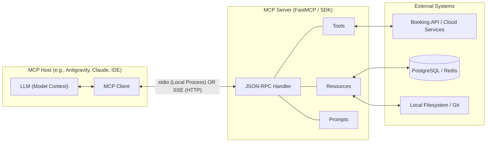
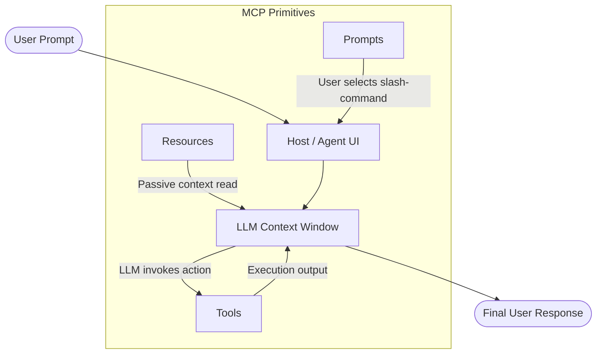
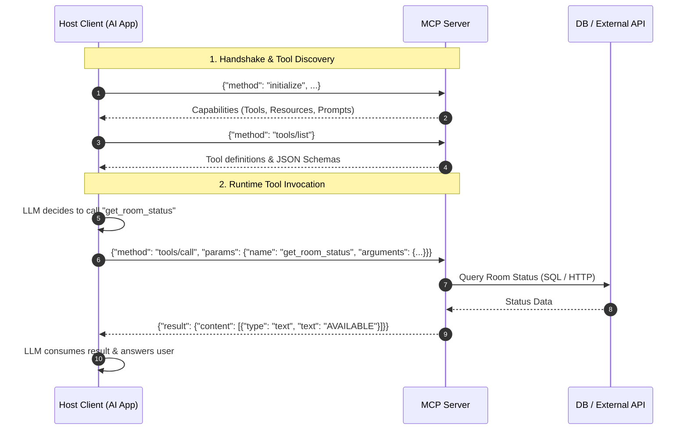

# Model Context Protocol (MCP)

**Status:** Research only (not yet built)
**OJT tracker category:** AI

## Summary

The Model Context Protocol (MCP) is an open standard created by Anthropic that standardizes how AI models securely discover and connect to external data sources, enterprise tools, and business workflows. Often called the "USB-C for AI," it provides a unified JSON-RPC protocol so any MCP-compliant AI client can interface with any MCP server without custom point-to-point integration code.

## Key Concepts

- **Client-Server Architecture:** 
  - **MCP Host:** The AI environment (e.g., Antigravity, Claude Code, Cursor).
  - **MCP Client:** The internal component inside the host that maintains connections to servers.
  - **MCP Server:** A lightweight standalone program or service that exposes specific capabilities.



- **The Three Core Primitives:**
  - **Tools (Model-Controlled):** Actionable functions the LLM decides to call dynamically (e.g., `check_room_availability`, `cancel_booking`).
  - **Resources (Context-Controlled):** Read-only data entities (URI-based, e.g., `postgres://bookings/schema` or `file:///logs/app.log`) attached as passive context.
  - **Prompts (User-Controlled):** Pre-packaged prompt templates and slash-command workflows (e.g., `/troubleshoot-booking`).



- **Transports:**
  - **`stdio` (Local):** Process communication via stdin/stdout; ideal for developer tooling, Git hooks, and local scripts.
  - **`SSE` (Remote):** Server-Sent Events over HTTP; ideal for centralized microservices, enterprise databases, and cloud APIs.
- **Security & Sandboxing:** Secrets, database credentials, and internal endpoints remain isolated inside the MCP server; the LLM only receives sanitized tool inputs and outputs.

## Reference / Cheatsheet

### Protocol Lifecycle (JSON-RPC 2.0)



1. **Discovery Handshake (`tools/list`):**
```json
// Request from Client
{ "jsonrpc": "2.0", "id": 1, "method": "tools/list" }

// Response from Server
{
  "jsonrpc": "2.0",
  "id": 1,
  "result": {
    "tools": [
      {
        "name": "get_room_status",
        "description": "Checks availability of a room for a given date",
        "inputSchema": {
          "type": "object",
          "properties": {
            "roomId": { "type": "string" },
            "date": { "type": "string", "format": "date" }
          },
          "required": ["roomId", "date"]
        }
      }
    ]
  }
}
```

2. **Tool Execution (`tools/call`):**
```json
// Client calls tool based on LLM decision
{
  "jsonrpc": "2.0",
  "id": 2,
  "method": "tools/call",
  "params": {
    "name": "get_room_status",
    "arguments": { "roomId": "room-101", "date": "2026-09-12" }
  }
}

// Server returns execution result
{
  "jsonrpc": "2.0",
  "id": 2,
  "result": {
    "content": [{ "type": "text", "text": "Room 101 is AVAILABLE." }]
  }
}
```

### Minimal Python MCP Server (`FastMCP`)

```python
# booking_mcp_server.py
from mcp.server.fastmcp import FastMCP

mcp = FastMCP("BookingSystemTools")

@mcp.tool()
def check_room_availability(room_id: str, date: str) -> str:
    """Checks if a room is available for booking on a specific date."""
    # Internal logic / Database call to BookingSystem API
    return f"Room {room_id} is available on {date}."

if __name__ == "__main__":
    mcp.run(transport="stdio")
```

### Host Configuration (`mcp_config.json`)

```json
{
  "mcpServers": {
    "booking-tools": {
      "command": "python",
      "args": ["/path/to/booking_mcp_server.py"]
    },
    "enterprise-remote": {
      "serverUrl": "https://mcp.internal.company.com/sse"
    }
  }
}
```

## Applied In This Project

Not applied — research-only per OJT Sprint 3 ("AI & Observability Research"). 

BookingSystem currently exposes standard REST endpoints via ASP.NET Core (`src/Booking.API`) consumed directly by the React frontend (`ui/Booking.UI`) and background Hangfire tasks (`src/Booking.Worker`). If applied in the future, an MCP server could wrap the BookingSystem Core API to allow AI assistants to check room inventory or trigger notifications directly via natural language.

## Related Notes

- [[spec-kit]] — Spec-Driven Development workflow for AI coding agents.
- [[sidecar-pattern]] — Architectural comparison: both patterns decouple core applications from ancillary services (logs vs AI context).
- [[postgresql_fundamentals]] — The primary data store that a BookingSystem MCP server would query behind tools.
- [[redis]] — Cached availability lookup pattern that an MCP server could leverage for low-latency queries.

## Open Questions / Next Steps

- Explore official .NET MCP SDKs (e.g., `ModelContextProtocol.NET`) to see if an MCP endpoint could be hosted directly alongside ASP.NET Core controllers in `Booking.API`.
- Test how role-based authorization (RBAC) maps over SSE transport when multiple users query the same company MCP server.
