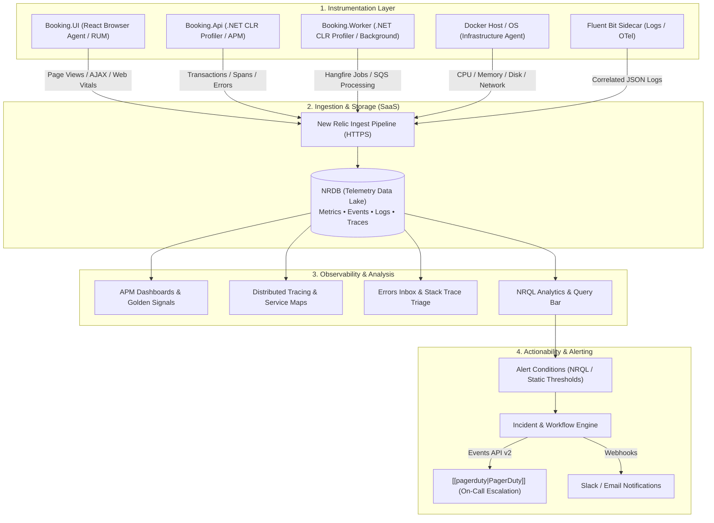
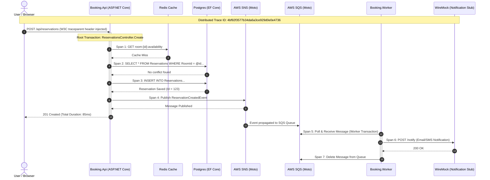
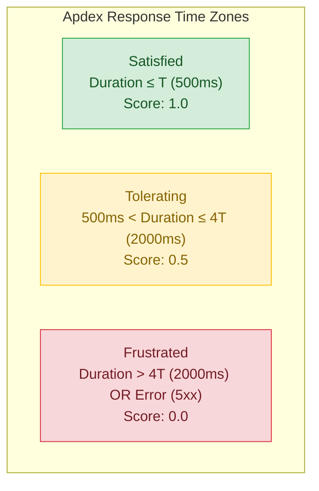
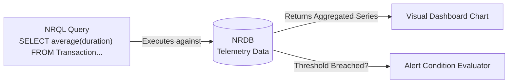

# New Relic

**Status:** Research only (not yet built)
**OJT tracker category:** DevOps / Observability

## Summary

New Relic is an all-in-one SaaS observability and Application Performance Monitoring (APM)
platform. While traditional monitoring asks *"Is the service up or down?"*, observability asks
*"Why is the reservation creation endpoint taking 3.8s instead of 120ms, which database query or
downstream dependency is stalling, and which specific users are affected?"*. It continuously
collects, correlates, and analyzes telemetry across application code, background workers,
databases, infrastructure, and user browsers.

## Key Concepts

### Telemetry Pillars (M.E.L.T.)

All telemetry ingested by New Relic falls into four primary data types:

| Data Type   | Description                                                         | Role in BookingSystem                                                                        |
| :---------- | :------------------------------------------------------------------ | :------------------------------------------------------------------------------------------- |
| **Metrics** | Aggregated numeric values over regular time windows                 | API throughput (RPM), CPU/Memory, Redis connection count, EF Core query latency              |
| **Events**  | Individual timestamped records containing rich key-value attributes | `Transaction` (e.g. `POST /api/reservations`), `TransactionError`, alert triggers            |
| **Logs**    | Structured or unstructured text events correlated with traces       | Serilog JSON output from `Booking.Api` & `Booking.Worker` matching current `trace.id`        |
| **Traces**  | The distributed execution path of a request through microservices   | Tracing a reservation request from `Booking.UI` → `Booking.Api` → SNS/SQS → `Booking.Worker` |

---

### Core Architecture & Ingestion Pipeline



1. **Instrumentation**: Agents hook into runtimes via native profilers (e.g. .NET CLR profiling API)
   or SDKs without requiring extensive source code rewrite.
2. **Data Collection**: Method durations, database commands, HTTP client calls, and exceptions are
   captured automatically.
3. **Safe Transmission**: In-memory buffers batch and compress telemetry before shipping over HTTPS.
   Sensitive inputs (passwords, auth headers, PII) are scrubbed at source.
4. **Correlation & Storage**: Everything lands in NRDB, tied together by unified entity IDs and
   distributed trace IDs.

---

### APM Hierarchy: Transactions and Spans

- **Transaction**: The high-level boundary of work monitored in an application.
  - *Web Transactions*: HTTP requests (e.g., `POST /api/reservations`).
  - *Non-Web Transactions*: Recurring jobs or queue pollers (e.g., Hangfire's
    `reservation-reminder-scan` or SQS message processing).
- **Span**: A distinct segment of execution within a transaction (e.g., executing a Postgres SQL
  query, pinging Redis, or publishing to SNS). Spans form the building blocks of a trace tree.



---

### The Four Golden Signals & Apdex

New Relic organizes APM health around the **Four Golden Signals**:

1. **Latency**: How long requests take to complete (measured in percentiles: P50, P95, P99).
2. **Traffic**: System demand and request volume (Requests Per Minute / RPM).
3. **Errors**: Ratio of requests failing (5xx HTTP status, unhandled runtime exceptions).
4. **Saturation**: Utilization of constrained resources (Postgres connection pool exhaustion,
   CPU/RAM, Hangfire job worker threads).

#### Apdex (Application Performance Index)
Apdex translates raw response times into a single customer satisfaction metric between `0.0` and
`1.0`, configured around a target threshold $T$ (e.g., $T = 500\text{ ms}$):

$$\text{Apdex} = \frac{\text{Satisfied Count} + \frac{\text{Tolerating Count}}{2}}{\text{Total Samples}}$$



---

### NRDB & NRQL (New Relic Query Language)

- **NRDB**: New Relic's schema-less time-series columnar datastore, handling real-time ingestion
  without upfront index management.
- **NRQL**: An SQL-like dialect used to query events and metrics, drive dashboards, and define
  dynamic alert condition thresholds.



## Reference / Cheatsheet

### 1. .NET Core CLR Profiler Configuration (Dockerfile)

For containerized .NET applications (`Booking.Api`, `Booking.Worker`), the New Relic .NET Agent is
configured via Linux environment variables hooking into the .NET Core profiling API:

```dockerfile
# Inside Booking.Api Dockerfile (Debian/Ubuntu runtime)
RUN apt-get update && apt-get install -y wget ca-certificates gnupg \
    && wget -q -O - https://download.newrelic.com/548C16BF.gpg | apt-key add - \
    && echo "deb http://apt.newrelic.com/debian/ newrelic non-free" > /etc/apt/sources.list.d/newrelic.list \
    && apt-get update \
    && apt-get install -y newrelic-dotnet-agent \
    && rm -rf /var/lib/apt/lists/*

# Enable CoreCLR Profiling
ENV CORECLR_ENABLE_PROFILING=1
ENV CORECLR_PROFILER={71E763DE-7722-4614-BD89-530CED4F1A50}
ENV CORECLR_PROFILER_PATH=/usr/local/newrelic-dotnet-agent/libNewRelicProfiler.so
ENV NEW_RELIC_LICENSE_KEY=${NEW_RELIC_LICENSE_KEY}
ENV NEW_RELIC_APP_NAME="Booking.Api"
ENV NEW_RELIC_DISTRIBUTED_TRACING_ENABLED=true
```

### 2. Custom Instrumentation in C# (`NewRelic.Agent.Api`)

When automatic instrumentation needs custom domain attributes or non-web background tracking:

```csharp
using NewRelic.Api.Agent;

public class ReservationReminderJob
{
    // Instruments a background method as a distinct transaction
    [Transaction]
    public async Task ProcessReminderAsync(Guid reservationId, CancellationToken ct)
    {
        // Add custom attributes to query in NRQL
        NewRelic.Api.Agent.NewRelic.AddCustomParameter("ReservationId", reservationId.ToString());

        try
        {
            await SendNotificationInternalAsync(reservationId, ct);
        }
        catch (Exception ex)
        {
            // Report handled error with contextual parameters to Errors Inbox
            NewRelic.Api.Agent.NewRelic.NoticeError(ex);
            throw;
        }
    }

    [Trace] // Tracks internal sub-method execution time as a Span
    private async Task SendNotificationInternalAsync(Guid id, CancellationToken ct)
    {
        // Business logic...
    }
}
```

### 3. Essential NRQL Queries for BookingSystem

#### A. Error Rate Percentage (API Health)
```sql
SELECT percentage(count(*), WHERE error IS true) AS 'Error Rate (%)'
FROM Transaction
WHERE appName = 'Booking.Api'
TIMESERIES 1 minute
SINCE 1 hour ago
```

#### B. P95 / P99 Latency Across Endpoints
```sql
SELECT percentile(duration, 50, 95, 99)
FROM Transaction
WHERE appName = 'Booking.Api'
FACET name
SINCE 2 hours ago
```

#### C. Slowest Database Queries (Postgres / EF Core)
```sql
SELECT average(duration), count(*)
FROM Datastore
WHERE appName = 'Booking.Api'
FACET statement
ORDER BY average(duration) DESC
LIMIT 10
SINCE 6 hours ago
```

#### D. Hangfire Background Job Execution Times
```sql
SELECT average(duration), max(duration), count(*)
FROM Transaction
WHERE appName = 'Booking.Worker' AND transactionType = 'Other'
FACET name
TIMESERIES 5 minutes
SINCE 1 day ago
```

#### E. Trace Specific Reservation by Custom Attribute
```sql
SELECT *
FROM Span
WHERE ReservationId = 'f47ac10b-58cc-4372-a567-0e02b2c3d479'
SINCE 1 day ago
```

---

### 4. Detect → Escalate Integration Pipeline

New Relic detects threshold breaches and forwards normalized incident events directly into
[[pagerduty|PagerDuty]]:

```mermaid
flowchart LR
    NR_MON[Booking.Api Telemetry] -->|Evaluates| NR_COND[NRQL Alert Condition\n5xx rate > 5% for 5m]
    NR_COND -->|Breached| NR_INC[New Relic Incident Created]
    NR_INC -->|Workflow Trigger| NR_DEST[Notification Destination]
    NR_DEST -->|Events API v2 POST| PD_KEY[PagerDuty Routing Key]
    PD_KEY --> PDS[PagerDuty Service]
    PDS --> EP[Escalation Policy & On-Call Page]
```



## Applied In This Project

Not applied in code — per the OJT plan (Phase 3 / Sprint 3), New Relic is a research-only topic
("reading, not build targets for BookingSystem").

In local development, this repository uses self-hosted [[splunk|Splunk]] and a
[[sidecar-pattern|Fluent Bit log-shipping container]] in `src/docker-compose.yml` because Splunk can
run completely offline and free inside Docker without external SaaS accounts or credit card
commitments. In a real-world cloud deployment:

- **`Booking.Api`** (`Program.cs`, controllers): The New Relic .NET CLR profiler would monitor
  ASP.NET Core request pipeline latency, measure middleware overhead (`GlobalExceptionMiddleware`,
  JWT auth verification), and establish the baseline Apdex score.
- **`Booking.Infrastructure`** (`BookingDbContext.cs`): EF Core queries against PostgreSQL would
  be automatically tracked as `Datastore` spans, immediately highlighting slow queries, missing
  indices, or unintentional N+1 query patterns.
- **`Booking.Infrastructure/Caching`** (`RedisRoomAvailabilityCache.cs`): Redis call latencies and
  cache hit/miss ratios would be captured as distinct spans.
- **`Booking.Worker`** (`ScheduledJobs/ReservationReminderJob.cs`): Hangfire recurring jobs and SQS
  consumer polling loops would be tracked as `OtherTransaction` instances to monitor queue latency
  and worker saturation.
- **Alerting Integration**: Critical NRQL alert policies (e.g. API error rate $> 5\%$ or database
  connection pool exhaustion) would trigger incidents routed via New Relic Workflows directly to
  [[pagerduty|PagerDuty]] to page on-call engineers.

## Related Notes

- [[pagerduty]] — the on-call notification and incident orchestration counterpart to New Relic's
  monitoring and detection engine.
- [[splunk]] — self-hosted log indexing and search used in this project's local environment.
- [[sidecar-pattern]] — the pattern used by Fluent Bit to decouple container stdout logs from the
  observability backend.
- [[hangfire]] — background job engine whose recurring scans represent non-web APM transactions.
- [[csharp-dotnet]] — .NET runtime architecture and CoreCLR profiler integration points.
- [[docker]] — container orchestration where environment variables and profiler paths are mounted.

## Open Questions / Next Steps

- **Proprietary Agent vs. OpenTelemetry (OTel)**: Compare the native New Relic .NET Agent with the
  vendor-agnostic OpenTelemetry .NET SDK (`OpenTelemetry.Exporter.OpenTelemetryProtocol`) exporting
  traces and metrics via OTLP to New Relic. OTel prevents vendor lock-in but may require more manual
  configuration compared to New Relic's zero-code CLR bytecode auto-instrumentation.
- **Distributed Trace Sampling in High-Throughput Scenarios**: In production with thousands of
  requests per second, evaluate New Relic's Head-based vs. Tail-based trace sampling to balance
  observability coverage against data ingestion billings.
- **PII / Header Sanitization**: Verify `newrelic.config` security attributes to ensure sensitive
  request headers (e.g., `Authorization: Bearer <jwt>`, credit card tokens, or hashed passwords)
  are completely scrubbed before egress.
