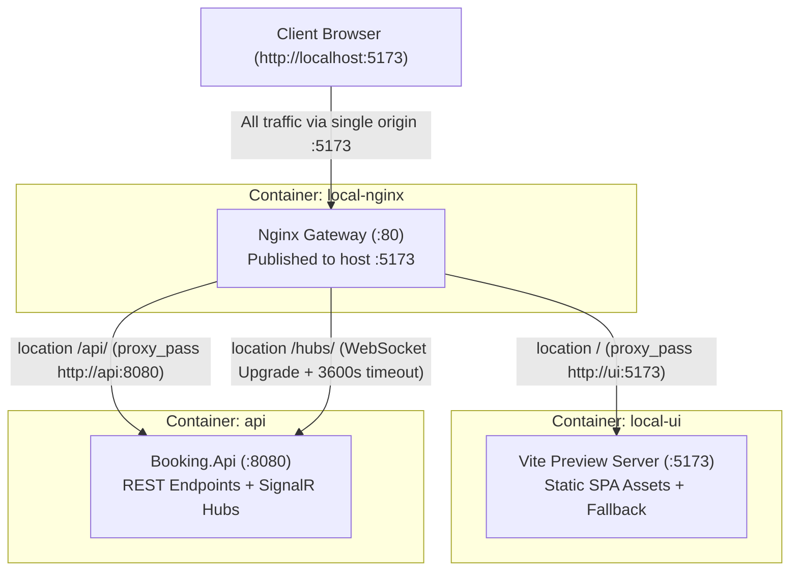

# Nginx Reverse Proxy Gateway

**Status:** Applied in project
**OJT tracker category:** DevOps / Web Server

## Summary

Nginx is an asynchronous, event-driven HTTP server and reverse proxy. In this project, Nginx runs as a dedicated standalone gateway container (`local-nginx`) placed in front of the application stack. It provides a single public origin on port 5173, routing root requests (`/`) to the frontend Vite preview container (`ui:5173`), API calls (`/api/*`) to the backend container (`api:8080`), and SignalR real-time connections (`/hubs/*`) with WebSocket protocol upgrade and long-lived connection timeouts.

## Key Concepts



- **Standalone Gateway Pattern (Separation of Concerns)**:
  - Nginx is decoupled from the UI application container into its own dedicated `nginx` service.
  - The `ui` container is strictly responsible for building the React app and running the Vite preview server on internal port 5173.
  - The `nginx` container serves as the ingress reverse-proxy gateway, abstracting backend infrastructure topology and unifying access points.
- **Dynamic Docker DNS Resolution via Variables**:
  - By default, Nginx resolves static hostnames in `proxy_pass` (e.g. `proxy_pass http://api:8080;`) once at startup. If the target container is not yet ready or restarts with a new IP, Nginx either crashes on launch (`host not found in upstream`) or sends requests to stale IPs.
  - Setting upstream URLs into variables (e.g. `set $api_upstream http://api:8080;`) coupled with Docker's embedded DNS directive (`resolver 127.0.0.11 valid=30s ipv6=off;`) forces Nginx to resolve container hostnames dynamically at runtime, allowing services to start or restart independently.
- **Single-Origin Deployment & Eliminating CORS**:
  - Browsers enforce Same-Origin Policy (SOP). Separated frontend (`:5173`) and API (`:8080`) ports require cross-origin headers and trigger preflight `OPTIONS` requests.
  - Routing both `/` and `/api/*` through Nginx on port 5173 gives the browser a single origin, removing the need for CORS in containerized environments.
- **WebSocket & Real-Time Connection Upgrade**:
  - Hop-by-hop HTTP headers (`Upgrade: websocket`, `Connection: upgrade`) are stripped by reverse proxies by default.
  - Nginx explicitly passes `$http_upgrade` and `"upgrade"` headers to upstream endpoints for both SignalR hubs (`/hubs/`) and frontend Vite streaming/HMR.
  - The default 60-second idle read timeout is increased to `proxy_read_timeout 3600s;` so quiet real-time SignalR hub sessions are not prematurely terminated.
- **Client Identity & Header Preservation**:
  - Standard headers (`Host`, `X-Real-IP`, `X-Forwarded-For`, `X-Forwarded-Proto`) are forwarded to upstream services, preserving client connection metadata for logging, rate limiting, and auditing.

## Reference / Cheatsheet

### Gateway Configuration (`src/nginx/nginx.conf`)

```nginx
server {
    listen 80;
    server_name _;

    # Docker internal DNS resolver (127.0.0.11)
    resolver 127.0.0.11 valid=30s ipv6=off;

    # Dynamic variables force runtime DNS resolution
    set $api_upstream http://api:8080;
    set $ui_upstream http://ui:5173;

    # Reverse-proxies API requests to the api container
    location /api/ {
        proxy_pass $api_upstream$request_uri;
        proxy_set_header Host $host;
        proxy_set_header X-Real-IP $remote_addr;
        proxy_set_header X-Forwarded-For $proxy_add_x_forwarded_for;
        proxy_set_header X-Forwarded-Proto $scheme;
    }

    # SignalR WebSocket connections with connection upgrade & long timeout
    location /hubs/ {
        proxy_pass $api_upstream$request_uri;
        proxy_http_version 1.1;
        proxy_set_header Upgrade $http_upgrade;
        proxy_set_header Connection "upgrade";
        proxy_set_header Host $host;
        proxy_set_header X-Real-IP $remote_addr;
        proxy_set_header X-Forwarded-For $proxy_add_x_forwarded_for;
        proxy_set_header X-Forwarded-Proto $scheme;
        proxy_read_timeout 3600s;
    }

    # Reverse-proxies frontend requests to the ui container (Vite preview)
    location / {
        proxy_pass $ui_upstream$request_uri;
        proxy_http_version 1.1;
        proxy_set_header Upgrade $http_upgrade;
        proxy_set_header Connection "upgrade";
        proxy_set_header Host $host;
        proxy_set_header X-Real-IP $remote_addr;
        proxy_set_header X-Forwarded-For $proxy_add_x_forwarded_for;
        proxy_set_header X-Forwarded-Proto $scheme;
    }
}
```

### Key Directives Reference

| Directive | Purpose in this Architecture |
| :--- | :--- |
| `resolver 127.0.0.11 valid=30s ipv6=off;` | Tells Nginx to query Docker's internal DNS server, revalidating every 30s and avoiding IPv6 lookup overhead. |
| `set $var http://...;` | Assigning the upstream to a variable forces Nginx to defer DNS resolution from configuration load time to request runtime. |
| `proxy_pass $var$request_uri;` | Preserves the entire incoming request URI when routing to dynamic upstreams. |
| `proxy_http_version 1.1;` | Required for persistent HTTP/1.1 connections and WebSocket handshakes. |
| `proxy_set_header Upgrade $http_upgrade;` | Forwards the client's WebSocket upgrade token to upstream services. |
| `proxy_read_timeout 3600s;` | Keeps idle SignalR WebSocket connections alive for up to 1 hour without timeout disconnects. |

### Useful CLI Commands

```bash
# Verify Nginx configuration syntax inside container
docker exec local-nginx nginx -t

# Hot-reload Nginx configuration after editing src/nginx/nginx.conf
docker exec local-nginx nginx -s reload

# Inspect gateway access and error logs
docker logs -f local-nginx
```

## Applied In This Project

- `src/nginx/nginx.conf` — Dedicated reverse proxy configuration mapping `/` to Vite preview (`ui:5173`), `/api/` to backend REST endpoints (`api:8080`), and `/hubs/` to SignalR (`api:8080`), with dynamic Docker DNS resolution (`127.0.0.11`).
- `src/docker-compose.yml`:
  - `nginx` (`local-nginx`) service: uses `nginx:alpine`, mounts `./nginx/nginx.conf:/etc/nginx/conf.d/default.conf:ro`, publishes `5173:80`, and is included in the `frontend` and `full` compose profiles.
  - `ui` (`local-ui`) service: runs the React app build and preview on internal port `5173` (`expose: - "5173"`), unexposed to host ports directly.
- `ui/Booking.UI/Dockerfile`:
  - Single-stage Node.js container (`node:22-alpine`) that builds the app with `ARG VITE_API_BASE_URL=/api` and starts the Vite preview server via `CMD ["npm", "run", "preview", "--", "--host", "0.0.0.0", "--port", "5173"]`.
- `README.md` — Docker compose profile table lists `frontend` as managing both `ui` and `nginx` together (`| frontend | ui, nginx | Frontend services (Vite UI container + Nginx reverse proxy gateway) |`).
- `src/Booking.Api/Program.cs` — The ASP.NET Core API keeps its CORS policy intact for local non-container development (`npm run dev` on host Vite server directly accessing port 8080/5133), while containerized access goes through the Nginx single origin.

## Related Notes

- [[docker]] — Docker Compose profiles, bridge networking, and container service discovery.
- [[sidecar-pattern]] — Decoupled infrastructure services and reverse proxy gateway architecture.
- [[csharp-dotnet]] — ASP.NET Core backend hosting `/api` controllers and SignalR hubs proxied by Nginx.

## Open Questions / Next Steps

- **Gzip / Brotli Compression**: Configure compression within `src/nginx/nginx.conf` to compress text, CSS, JS, and JSON payloads at the proxy layer.
- **SSL / TLS Termination**: Terminate HTTPS at the Nginx gateway in staging/production, passing decrypted traffic internally to `ui` and `api`.
- **API Rate Limiting**: Introduce Nginx `limit_req_zone` rules to throttle brute-force or abuse attempts on `/api/auth` and reservation creation endpoints.
