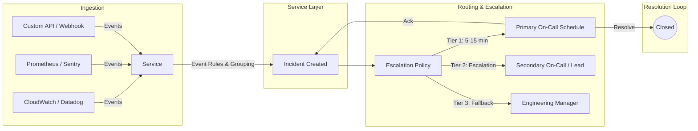
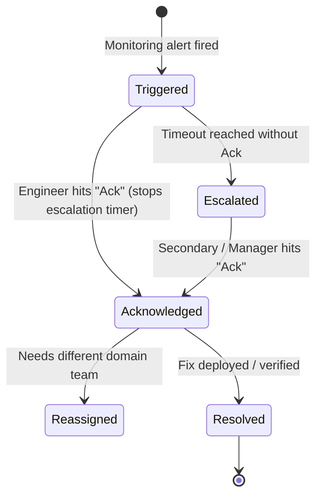
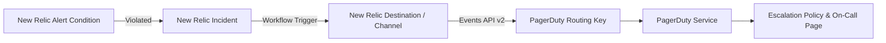

# PagerDuty

**Status:** Research only (not yet built)
**OJT tracker category:** DevOps / Observability

## Summary

PagerDuty is a SaaS incident response and operations orchestration platform. It collects alert
signals from monitoring and observability tools, determines urgency, and dispatches actionable
incidents to the appropriate on-call engineers via phone calls, SMS, push notifications, or email
according to configurable schedules and escalation policies.

## Key Concepts

### Architecture & Notification Flow



- **Core Hierarchy**:
  - **Service** — represents an application, microservice, or infrastructure component (e.g.,
    `booking-api`, `booking-worker`, `postgres-db`). Integrations connect here.
  - **Event** — raw incoming JSON payload sent from monitoring tools via the Events API.
  - **Alert** — normalized representation of an event within PagerDuty. Multiple alerts can group
    into a single incident.
  - **Incident** — actionable work item requiring human triage and paging engineers.
- **Escalation Policy (EP)** — rules dictating notification order and timeout thresholds across
  tiers:
  - **Tier 1 (Primary On-Call):** Notified immediately (10–15 min timeout).
  - **Tier 2 (Secondary / Shadow):** Notified if Tier 1 fails to acknowledge within the timeout.
  - **Tier 3 (Team Lead / Engineering Manager):** Fallback safeguard before the policy loops.
  - **Repeat Loop:** Configured to re-cycle through tiers 1–3 times before stalling.
- **Schedules & Rotations** — calendar-based on-call coverage:
  - **Models:** Follow-the-Sun (geographically distributed 8-hour shifts), Weekly Primary &
    Secondary, or Daily Split.
  - **Operational discipline:** Mid-week handoffs (e.g., Wednesday noon) keep full team context
    active during rotation handoffs; temporary coverage uses schedule overrides rather than editing
    base rotations.
- **Incident Lifecycle**:
  - **Triggered:** Alert received, paging starts.
  - **Acknowledged (Ack):** Halts escalation timer, signaling *"an engineer is actively
    investigating"* (acknowledging is not resolving).
  - **Reassigned / Escalated:** Route to another specialty team or higher tier if needed.
  - **Resolved:** Incident closed, paging stops completely.



- **Urgency Levels** — **High Urgency** fires noisy personal notifications (phone call, SMS, push);
  **Low Urgency** limits delivery to email or Slack/Teams (can be deferred to business hours).
- **Deduplication (`dedup_key`)** — incoming events sharing the same deduplication key roll into
  the existing open incident. Crucially, an incoming event with `event_action: "resolve"` and that
  same `dedup_key` automatically closes the incident when monitoring recovers, preventing phantom
  pages.
- **Alert Fatigue Prevention**:
  - Alert on symptoms and SLO breaches (e.g., 5xx error rate spike, database connection exhaustion),
    not ambient causes (e.g., momentary CPU jitter).
  - Use Content-Based or Intelligent Alert Grouping to suppress cascading storms.
  - Attach runbook links and monitoring dashboard deep-links to every service alert.

## Reference / Cheatsheet

### Detect → Escalate Integration Pipeline



### Events API v2 Payload (`POST https://events.pagerduty.com/v2/enqueue`)

```json
{
  "routing_key": "YOUR_INTEGRATION_KEY",
  "event_action": "trigger",
  "dedup_key": "booking-api-high-error-rate",
  "payload": {
    "summary": "Booking API 5xx rate exceeded 5% over 5m window",
    "severity": "critical",
    "source": "booking-api.production",
    "component": "Booking.Api",
    "group": "ReservationsController",
    "custom_details": {
      "error_rate": "7.8%",
      "threshold": "5.0%",
      "dashboard_url": "https://one.newrelic.com/..."
    }
  },
  "links": [
    {
      "href": "https://wiki.internal/runbooks/booking-api-5xx",
      "text": "Triage Runbook"
    }
  ]
}
```

* `event_action` options: `"trigger"`, `"acknowledge"`, `"resolve"`.
* `severity` options: `"critical"`, `"error"`, `"warning"`, `"info"`.

### Terraform (IaC) Provisioning Example

```hcl
# 1. Reference existing default escalation policy
data "pagerduty_escalation_policy" "default" {
  name = "Engineering Escalation Policy"
}

# 2. Declare the PagerDuty Service
resource "pagerduty_service" "booking_api" {
  name                    = "Booking API"
  auto_resolve_timeout    = 14400 # 4 hours
  acknowledgement_timeout = 600   # 10 minutes
  escalation_policy       = data.pagerduty_escalation_policy.default.id
  alert_creation          = "create_alerts_and_incidents"
}

# 3. Create integration key (e.g., for New Relic or generic Events API)
data "pagerduty_vendor" "newrelic" {
  name = "New Relic"
}

resource "pagerduty_service_integration" "booking_api_nr" {
  name    = "New Relic Alerts"
  service = pagerduty_service.booking_api.id
  vendor  = data.pagerduty_vendor.newrelic.id
}
```

## Applied In This Project

Not applied — per the OJT plan (Phase 3 / Sprint 3), PagerDuty is a research-only topic ("reading,
not build targets for BookingSystem").

Unlike Splunk (which is self-hosted locally as a container in `src/docker-compose.yml`), PagerDuty
is a commercial SaaS platform that requires a live organization account and valid service integration
routing keys. In a production deployment of BookingSystem:
- New Relic would monitor API latency, HTTP 5xx responses, and Hangfire reminder queue lag.
- When an alert condition triggers, New Relic forwards the incident payload to PagerDuty's Events API
  via `pagerduty_service_integration`.
- PagerDuty executes the on-call escalation policy to page the responsible on-call engineer.

## Related Notes

- [[new-relic]] — the detection and observability side of the detect → escalate pipeline
  (evaluates alert conditions, tracks golden signals, and triggers PagerDuty).
- [[splunk]] — self-hosted log indexing and search used in this project's local environment.
- [[sidecar-pattern]] — how local container telemetry is decoupled and shipped to observability
  backends.

## Open Questions / Next Steps

- Review the end-to-end detect → notify pipeline paired with `[[new-relic]]` to verify payload
  mapping and deduplication keys.
- For a hypothetical production setup: determine service boundaries in PagerDuty (separate services
  for `booking-api`, `booking-worker`, and infra/storage vs. a unified service with rule-based routing).
